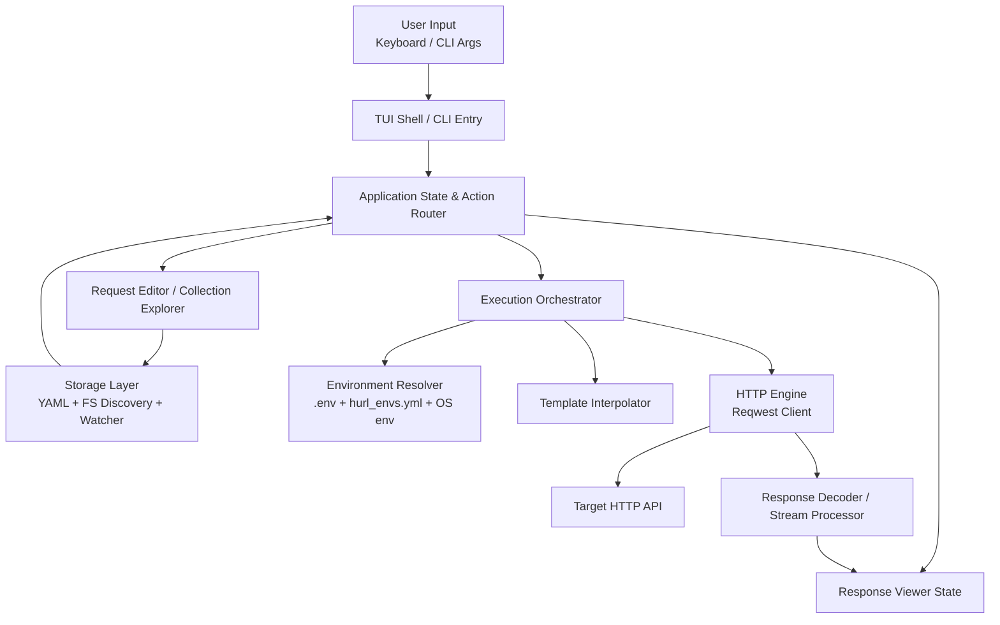
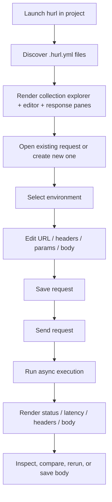
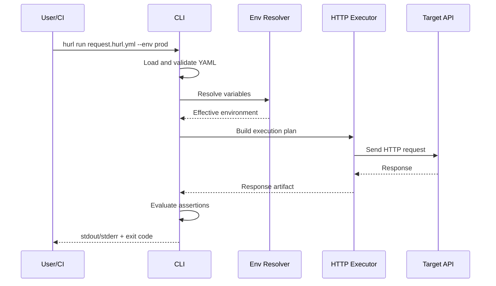

# hurl Product Requirements Document

Version: 1.0  
Date: March 29, 2026  
Status: Draft  
Product: hurl (HTTP Ultra-Rapid Launcher)

## 1. Product Overview

### Summary

hurl is a local-first, terminal-native API client for developers who prefer editor- and shell-centric workflows over heavyweight GUI tools. It combines the speed and composability of CLI tools with the ergonomics of a structured TUI for constructing, executing, inspecting, and sharing HTTP requests.

The product is positioned as the practical middle ground between:

- `curl`, which is fast and scriptable but cumbersome for complex requests.
- Postman and Insomnia, which are feature-rich but heavy, mouse-centric, and poorly aligned with Git-native collaboration.
- Bruno, which is local-first and Git-friendly, but still GUI-led rather than terminal-native.

### Product Vision

Make API testing feel native to the terminal while preserving team-grade workflows such as version control, code review, environment switching, and CI execution.

### Product Principles

- Terminal-first: the primary experience lives entirely in the terminal.
- Local-first: request collections and environment data are plain files on disk.
- Git-native: requests must be readable, diffable, and reviewable in pull requests.
- Fast by default: startup, navigation, and request execution should feel immediate.
- Minimal surface area: MVP avoids becoming a platform before core workflows are excellent.

### Positioning Statement

For backend engineers, DevOps practitioners, and API-heavy teams who live in the terminal, hurl is the API client that keeps request authoring, execution, and collaboration inside the shell. Unlike Electron-based GUI clients, hurl stores requests as text, launches instantly, and is designed for keyboard-driven speed.

## 2. Problem Statement

Developers who work primarily in terminals face a tradeoff:

- `curl` is always available and fast, but request composition becomes error-prone once headers, auth, query params, bodies, environments, and repeated workflows enter the picture.
- GUI API clients improve ergonomics, but introduce context switching, slow startup, high memory usage, weak keyboard-first workflows, and poor Git ergonomics.
- Team sharing is often mediated through proprietary exports or large JSON blobs that are difficult to diff, review, and maintain.

This creates friction in common workflows:

- Testing local services while monitoring logs in adjacent terminal panes.
- Reusing and sharing requests across services and environments.
- Running the same saved request interactively during development and headlessly in CI.
- Handling large or binary responses without freezing the tool or corrupting the display.

### Core User Problem

There is no dominant tool that is simultaneously:

- terminal-native,
- fast enough for habitual use,
- ergonomic for request construction,
- local-file based,
- and suitable for Git collaboration.

## 3. Goals and Success Metrics

### Product Goals

| Goal | Description | Priority |
|---|---|---|
| Fast terminal workflow | Make request creation and execution meaningfully faster than GUI tools for terminal-native users | P0 |
| Git-native collaboration | Store requests in readable text files suitable for review and reuse | P0 |
| Dual-mode usage | Support both interactive TUI usage and headless CLI execution | P0 |
| Environment-aware testing | Let users switch target environments without editing requests | P0 |
| Robust response handling | Keep the UI responsive for large, slow, or binary responses | P0 |
| Extensibility path | Leave a clean path to assertions, scripting, and plugins in later versions | P1 |

### Success Metrics

| Metric | Target | Phase |
|---|---|---|
| Cold startup to first render | `< 50ms` on a typical dev laptop | MVP target |
| Idle memory usage | `< 50MB` | MVP target |
| Memory during large response inspection | `< 100MB` for standard large-text workflows | MVP target |
| Added client overhead beyond network latency | `< 5ms` median processing overhead excluding rendering | MVP target |
| TUI frame responsiveness during in-flight requests | No visible UI freeze; render loop remains responsive at configured frame rate | MVP target |
| Headless run parity | 100% of saved request files runnable via `hurl run` | V1 |
| Collection discoverability | Project-local requests auto-discovered in current working tree | MVP |
| Time-to-first-successful-request for new user | `< 3 minutes` from install in guided happy path | V1 |

### Qualitative Success Signals

- Users replace ad hoc `curl` commands for repeated workflows.
- Teams commit request collections into repositories instead of sharing exports.
- Developers keep hurl open in tmux during service development.

## 4. User Personas

### Persona A: CLI Purist

| Attribute | Detail |
|---|---|
| Role | Backend Engineer |
| Environment | Neovim, tmux, shell, local microservices |
| Motivation | Stay in terminal, avoid mouse and context switching |
| Frustration | Complex `curl` commands are hard to type, read, and reuse |
| Success | Build and resend API requests without leaving terminal context |

### Persona B: GitOps Advocate

| Attribute | Detail |
|---|---|
| Role | DevOps Engineer / API Architect |
| Environment | Monorepos, infra repos, review-heavy teams |
| Motivation | Treat operational knowledge and API workflows as versioned text |
| Frustration | Postman/Insomnia exports are opaque, bulky, and awkward in code review |
| Success | Commit shared request collections and environment templates to Git |

### Persona C: Service Integrator

| Attribute | Detail |
|---|---|
| Role | Full-stack or platform engineer |
| Environment | Multiple staging/prod/dev environments |
| Motivation | Quickly verify behavior across services and environments |
| Frustration | Re-entering auth headers, changing hosts, and comparing results is repetitive |
| Success | Reuse the same request with environment substitution and minimal edits |

## 5. User Stories

### MVP Stories

- As a developer, I want to open `hurl` in a project directory and immediately see saved requests discovered from disk.
- As a developer, I want to build a request with method, URL, headers, query params, and body using a keyboard-driven TUI.
- As a developer, I want to send a request with a single shortcut and inspect status, latency, headers, and body in a response pane.
- As a developer, I want to save a request to a readable `.hurl.yml` file so I can commit it to Git.
- As a developer, I want to load environment values from `.env` and `hurl_envs.yml` so I can switch between dev, staging, and prod.
- As a developer, I want to run `hurl run <file> --env <name>` in CI or scripts without launching the TUI.

### V1/V2 Stories

- As a developer, I want to diff two responses to compare old and new endpoints.
- As a developer, I want to define assertions in request files and fail CI when expectations do not hold.
- As a developer, I want pre-request and post-response hooks for auth token generation or response extraction.
- As a power user, I want a plugin system for custom auth and organization-specific integrations.

## 6. Core Features and Functional Requirements

### 6.1 Request Builder

The TUI must provide a structured request editor with the following fields:

| Area | Requirements |
|---|---|
| Method | Select from standard HTTP verbs: `GET`, `POST`, `PUT`, `PATCH`, `DELETE`, `HEAD`, `OPTIONS` |
| URL | Editable input with environment variable interpolation |
| Query Params | Key/value list editor with enable/disable support |
| Headers | Key/value list editor with masking for marked-sensitive values |
| Body | Raw text editor for JSON, form, plain text, XML, and arbitrary payloads |
| Auth | MVP supports bearer and basic auth through headers or auth subpanel; advanced auth deferred |

#### Functional Requirements

- Users can navigate among request sections using keyboard shortcuts only.
- Users can add, edit, delete, and reorder headers and params.
- Users can edit multi-line bodies.
- Users can save the in-memory request as a `.hurl.yml` file.
- Unsaved changes must be visibly indicated.
- Save and send actions must use the current in-focus field contents even if the user has not explicitly exited the field first.

### 6.2 Response Viewer

The response pane must provide:

| Capability | Requirement |
|---|---|
| Summary | Show status code, duration, response size, content type, and final URL |
| Body view | Display text payloads with syntax-aware formatting where possible |
| Headers view | Display response headers in a tabular format |
| Metadata | Show HTTP version and redirect information when available |
| Binary handling | Detect likely binary responses and avoid rendering raw bytes as text |
| Large payload behavior | Avoid blocking the UI while loading or formatting large responses |

#### Functional Requirements

- JSON responses should support pretty formatting in MVP.
- Collapsible JSON tree view is targeted for V1 unless implementation cost is low enough for MVP.
- Binary responses should surface a prompt or action to save to disk.
- Large responses should progressively load or render in a memory-conscious way.
- Canceling an in-flight request should remain effective while the response body is still streaming.

### 6.3 Directory-Based Collections

#### Functional Requirements

- On startup, hurl scans the current working directory recursively for `.hurl.yml` files.
- The left pane displays discovered collections grouped by filesystem path.
- Users can open an existing request from the collection tree and edit it in-place.
- The tool should ignore standard junk directories by default, such as `.git`, `node_modules`, `target`, and large vendor directories.
- File changes made outside hurl should be reflected through reload or watcher-driven refresh.
- Collection tree collapse/expand behavior should be reversible without requiring a manual refresh.

### 6.4 Environment Variables

#### Functional Requirements

- hurl supports interpolation tokens in request files using `{{variable_name}}`.
- hurl loads environment data from:
  - project `.env`,
  - optional `.env.<name>` files,
  - `hurl_envs.yml`.
- In headless mode, these files are resolved relative to the saved request file being executed so nested collections behave predictably in monorepos and CI workspaces.
- Environment resolution precedence for MVP:
  1. explicit CLI flags,
  2. selected named environment in `hurl_envs.yml`,
  3. `.env.<name>`,
  4. `.env`,
  5. OS environment variables.
- Missing variables should fail with a clear error in headless mode and a visible inline error in TUI mode.

### 6.5 Dual-Mode Execution

#### TUI Mode

Command:

```bash
hurl
```

Requirements:

- Opens the interactive TUI in the current working directory.
- Auto-discovers collections.
- Preserves responsiveness while requests run in the background.

#### CLI Mode

Command examples:

```bash
hurl run requests/create_user.hurl.yml --env prod
hurl run requests/create_user.hurl.yml --env dev --output json
```

Requirements:

- Executes a saved request without launching the TUI.
- Prints response body or structured summary to stdout based on flags.
- Returns non-zero exit codes on transport failures or failed assertions.
- Returns exit code `130` when interrupted by the user with `Ctrl+C`.
- Supports CI-safe output mode.

### 6.6 Keyboard and Interaction Model

| Shortcut | Action |
|---|---|
| `Tab` / `Shift+Tab` | Cycle focus between panes |
| `j` / `k` | Move vertically in lists |
| `h` / `l` | Move between tabs or sibling sections |
| `Enter` or `Ctrl+R` | Send request |
| `Ctrl+S` | Save request |
| `?` | Open help or command palette |
| `Esc` | Back, cancel modal, or leave focused editor mode |
| `Ctrl+C` | Cancel in-flight request or exit when idle |

### 6.7 File Format

MVP request files use YAML for readability and Git diffs.

#### Example Request File

```yaml
name: "Create New User"
method: POST
url: "{{base_url}}/api/v1/users"
headers:
  Content-Type: "application/json"
  Authorization: "Bearer {{token}}"
body: |
  {
    "username": "tui_fanatic",
    "role": "admin"
  }
assertions:
  - expect_status: 201
  - expect_time_under: 500ms
  - expect_body_path:
      path: "$.user.id"
      operator: eq
      expected: 42
```

#### Functional Requirements

- The serializer must preserve human readability.
- Stable key ordering should be used when possible.
- Assertion YAML should remain mapping-based and readable in diffs, for example `- expect_status: 201` and `- expect_time_under: 500ms`.
- Unknown future fields should be tolerated when practical to support forward compatibility.

## 7. Non-Functional Requirements

### Performance

| Requirement | Target |
|---|---|
| Startup | `< 50ms` to rendered shell on representative developer machines |
| Idle memory | `< 50MB` |
| Large response workflows | `< 100MB` under heavy text parsing scenarios |
| Frame responsiveness | Target 60 FPS configurable render loop; no frozen UI during request execution |

### Reliability

- No request execution should crash the TUI process.
- Terminal state must always be restored on normal exit, error, or panic.
- Cancellation must be graceful and leave the app in a usable state.

### Portability

- MVP supports macOS and Linux.
- Windows support is desirable but may be V1 depending on terminal backend validation.

### Maintainability

- Core logic must be reusable by both TUI and CLI modes.
- Storage, HTTP execution, interpolation, and presentation layers must remain separated.
- Modules should be structured to enable snapshot, unit, and integration tests independently.

### Accessibility and Learnability

- The TUI must expose visible key hints and focus state.
- First-run help should make core workflows discoverable.
- Color should not be the sole indicator of state.

## 8. System Architecture Overview

### Architecture Summary

hurl is a single-user local application with no required backend service in MVP. The product consists of:

- a core request engine,
- a terminal UI shell,
- a headless CLI runner,
- a file-backed storage/discovery layer,
- and an environment/interpolation subsystem.

The recommended implementation stack is:

- Rust for performance and predictable memory behavior.
- Ratatui for the TUI.
- Crossterm backend for terminal I/O.
- Tokio for async runtime, task orchestration, and cancellation.
- Reqwest for HTTP transport.

### Scaffolding Recommendation

Based on current Ratatui documentation and templates, hurl should scaffold from the official Ratatui templates at [ratatui.rs/templates](https://ratatui.rs/templates/). For hurl specifically, the best starting point is the official `component` template rather than a minimal template because hurl needs:

- multiple panes,
- async background request execution,
- structured event handling,
- tracing/logging,
- CLI argument parsing,
- and a modular component tree.

The official component template documents a project structure with modules such as `action.rs`, `app.rs`, `cli.rs`, `config.rs`, `logging.rs`, `main.rs`, `tui.rs`, and `components/*`, which matches hurl’s expected growth path.

### High-Level Architecture Diagram



### Logical Layering

| Layer | Responsibility |
|---|---|
| Presentation | Ratatui widgets, focus handling, navigation, help, modals |
| Application | Action dispatch, app state, pane coordination, command routing |
| Domain | Request model, execution plan, assertions, environment interpolation |
| Infrastructure | File I/O, YAML parsing, HTTP client, logging, watcher, plugin host later |

### Concurrency Model

The UI thread must remain render-responsive while requests execute asynchronously. The recommended model is:

- TUI render/update loop owns UI state.
- Request execution runs as background Tokio tasks.
- UI and worker tasks communicate through typed events/actions.
- Cancellation is coordinated with Tokio cancellation tokens or equivalent task cancellation control.
- CPU-heavy formatting or parsing for large payloads should use `spawn_blocking` where needed.

### Recommended Internal Architecture Pattern

Use a hybrid of:

- The Elm Architecture for top-level state transitions (`Model`, `Update`, `View`).
- Component architecture for pane-local rendering and event handling.

This aligns with Ratatui’s current documentation, which presents both TEA and component-based patterns as first-class organizational approaches.

## 9. Data Models / Entities

The following models are proposed for MVP.

### 9.1 RequestDocument

```rust
struct RequestDocument {
    id: String,
    path: PathBuf,
    name: String,
    method: HttpMethod,
    url_template: String,
    query_params: Vec<KeyValueField>,
    headers: Vec<KeyValueField>,
    body: Option<RequestBody>,
    assertions: Vec<Assertion>,
    metadata: RequestMetadata,
}
```

### 9.2 EnvironmentSet

```rust
struct EnvironmentSet {
    name: String,
    values: BTreeMap<String, String>,
    source_chain: Vec<EnvSource>,
}
```

### 9.3 ExecutionRun

```rust
struct ExecutionRun {
    request_id: String,
    environment_name: Option<String>,
    started_at: DateTime<Utc>,
    finished_at: Option<DateTime<Utc>>,
    status: RunStatus,
    effective_url: Option<String>,
    error: Option<ExecutionError>,
}
```

### 9.4 ResponseArtifact

```rust
struct ResponseArtifact {
    status_code: u16,
    http_version: String,
    headers: Vec<KeyValueField>,
    content_type: Option<String>,
    content_length: Option<u64>,
    duration_ms: u128,
    body_kind: BodyKind,
    body_text_preview: Option<String>,
    body_bytes_path: Option<PathBuf>,
}
```

### 9.5 CollectionNode

```rust
struct CollectionNode {
    name: String,
    path: PathBuf,
    kind: CollectionNodeKind,
    children: Vec<CollectionNode>,
}
```

### YAML Schema Proposal

```yaml
name: string
method: GET|POST|PUT|PATCH|DELETE|HEAD|OPTIONS
url: string
params:
  - key: string
    value: string
    enabled: true
headers:
  - key: string
    value: string
    enabled: true
body:
  mode: raw|json|form|binary_ref
  content: string
auth:
  type: none|basic|bearer
  username: string
  password: string
  token: string
assertions:
  - expect_status: 200
  - expect_time_under: 500ms
metadata:
  tags: ["users", "smoke"]
```

### Notes

- `id` may be derived from path in MVP rather than persisted separately.
- Response bodies larger than a configurable threshold should spill to temp storage instead of staying fully in memory.
- Request editor state and saved document state should be distinct to support dirty tracking.

## 10. API Design

### External API Surface

hurl is not a server product in MVP, so there is no public network API to design. The primary user-facing interface is:

- command-line commands,
- YAML request schemas,
- and internal trait boundaries for engine reuse.

### CLI Interface Proposal

| Command | Purpose |
|---|---|
| `hurl` | Launch interactive TUI |
| `hurl run <file>` | Execute a saved request headlessly |
| `hurl fmt <file>` | Normalize file format and ordering |
| `hurl validate <file>` | Validate schema, interpolation, and assertions syntax |
| `hurl list` | List discovered request files in current project |

### CLI Examples

```bash
hurl
hurl run requests/create_user.hurl.yml --env dev
hurl run requests/get_users.hurl.yml --env prod --fail-on-assertion
hurl validate requests/create_user.hurl.yml
hurl fmt requests/create_user.hurl.yml
```

### Internal Trait Boundaries

```rust
trait RequestRepository {
    fn discover(&self, cwd: &Path) -> Result<Vec<RequestDocument>, RepoError>;
    fn load(&self, path: &Path) -> Result<RequestDocument, RepoError>;
    fn save(&self, request: &RequestDocument) -> Result<(), RepoError>;
}

trait EnvironmentProvider {
    fn resolve(&self, selection: Option<&str>) -> Result<EnvironmentSet, EnvError>;
}

trait HttpExecutor {
    async fn execute(&self, plan: ExecutionPlan) -> Result<ResponseArtifact, ExecutionError>;
}
```

### Exit Code Contract

| Exit Code | Meaning |
|---|---|
| `0` | Success |
| `1` | Internal or configuration error |
| `2` | Request validation or interpolation failure |
| `3` | Network or transport failure |
| `4` | Assertion failure |

## 11. User Flow

### Primary TUI Flow



### Headless CLI Flow



### First-Run Experience

- Detect when no request files are present.
- Offer a minimal creation flow rather than an empty shell.
- Surface a bottom help bar with critical shortcuts.
- Provide one sample request flow or inline empty-state instructions.

## 12. Edge Cases and Failure Handling

| Scenario | Expected Behavior |
|---|---|
| 50MB JSON response | Stream body, avoid blocking render loop, show loading/progressive state, optionally save to file |
| Binary response | Detect non-text content type or byte heuristics and offer save-to-disk action |
| Hanging request | Keep UI responsive and allow cancellation with `Ctrl+C` or explicit cancel key |
| Missing env variable | Fail clearly before send with missing variable list |
| Invalid YAML | Show validation error with file path and line context where possible |
| HTTP redirect chain | Show final URL and redirect count in response metadata |
| Non-UTF8 text | Decode conservatively, show fallback or raw-bytes save option |
| Compressed response | Respect client decompression behavior and reflect decoded size if available |
| Very large headers/body in editor | Keep editor interactive and avoid expensive full reformat on every keystroke |
| File changed externally | Prompt reload if local edits are dirty; auto-refresh if clean |
| Terminal resize | Reflow panes without corrupting input or response state |
| Panic or fatal error | Restore terminal state and emit readable error report |

### Cancellation Requirements

- Cancelling an in-flight request must not kill the whole app.
- After cancellation, the user should remain in the same request context.
- Partially streamed bodies should be discarded or marked incomplete.

## 13. Security and Privacy Considerations

### Security Goals

- Prevent accidental leakage of secrets in logs, files, or terminal output.
- Preserve the user’s local-first trust model.
- Avoid plugin execution risk in MVP by deferring plugins to a later milestone.

### Requirements

- Sensitive headers such as `Authorization` should be maskable in the UI.
- Logs must redact configured sensitive fields by default.
- hurl must never require cloud sync or remote storage in MVP.
- Temporary files containing response bodies should use OS temp locations with clear lifecycle rules.
- Environment files must be loaded locally only.
- Request execution should not silently persist secrets into saved request files unless the user explicitly saves them.

### Plugin Security

For V2+, plugins should be sandboxed. WASM is the recommended direction, but the host selection between Wasmtime and Extism should be treated as an implementation spike rather than locked in by this PRD.

### Privacy

- No telemetry in MVP unless explicitly enabled later.
- If telemetry is ever added, it must default to off for self-managed CLI usage.

## 14. Dependencies and Assumptions

### Confirmed Technical Inputs

- Rust is the implementation language.
- Ratatui is the TUI framework.
- Tokio is the async runtime.
- Reqwest is the HTTP client.
- YAML is the persisted request format.

### Assumptions

- MVP does not require login, sync, team accounts, or cloud infrastructure.
- MVP supports HTTP/HTTPS request execution only; WebSocket and gRPC are out of scope.
- MVP focuses on request authoring and execution, not API documentation generation.
- Assertions exist in the schema but may ship in a limited initial form.
- A local filesystem watcher is desirable but may fall back to manual refresh on unsupported environments.

### Proposed Crates and Libraries

| Concern | Proposed Dependency | Notes |
|---|---|---|
| TUI | `ratatui`, `crossterm` | Core terminal UI stack |
| Async runtime | `tokio` | Required for background execution and event orchestration |
| HTTP | `reqwest` | Reusable client, timeouts, streaming, TLS |
| Serialization | `serde`, `serde_yaml` | YAML storage |
| CLI parsing | `clap` | Aligns with Ratatui component template |
| Error reporting | `color-eyre`, `thiserror` | `thiserror` for domain errors, `anyhow` only if needed at binary edge |
| Logging | `tracing`, `tracing-subscriber` | Structured diagnostics |
| File watching | `notify` | Optional for collection auto-refresh |
| Env loading | `dotenvy` or equivalent | `.env` parsing |

## 15. Milestones / Development Phases

### Phase 0: Foundations and Scaffolding

Duration: 3-5 days

- Scaffold project from the official Ratatui `component` template from [ratatui.rs/templates](https://ratatui.rs/templates/).
- Establish crate/module boundaries.
- Wire terminal lifecycle, logging, panic handling, and CLI entrypoints.
- Create a minimal three-pane shell with focus state and placeholder data.

### Phase 1: MVP Core Request Loop

Duration: Weeks 1-3

- Collection discovery from current working directory.
- Request editor for method, URL, headers, params, and raw body.
- Async execution via Reqwest with cancellation.
- Response summary, headers, and body inspection.
- Save/load `.hurl.yml`.
- Basic environment interpolation.

### Phase 2: Git Workflow and Headless Mode

Duration: Weeks 4-6

- `hurl run` CLI mode.
- `--env` selection and precedence rules.
- Validation and formatter commands.
- Stable serialization and helpful diff behavior.
- Better dirty-state handling and external file reload behavior.

### Phase 3: Power User Foundation

Duration: Months 2-3

- Assertions engine.
- Response diffing.
- Richer JSON viewer.
- Better binary save flows.
- First-run tutorial and discoverability improvements.

### Phase 4: Extensibility

Duration: Post-V1

- Pre-request/post-response hooks.
- WASM-based plugin host.
- Custom auth providers.
- Variable providers and request-level auth plugin selection.

### Delivery Gates

| Gate | Criteria |
|---|---|
| Alpha | TUI launches, request can be edited, sent, and viewed |
| Beta | Headless runner works in CI and file format is stable |
| V1 | Core workflows are reliable, responsive, and documented |

## 16. Open Questions

1. Should `.hurl.yml` remain the only request extension, or should `.hurl.yaml` also be supported for compatibility?
2. Should auth be modeled as first-class structured fields in MVP, or remain header-driven until V1?
3. Do we want a built-in body editor only, or a workflow to shell out to `$EDITOR` for larger bodies from day one?
4. Should the response viewer store large bodies in temp files by default above a threshold, and what should that threshold be?
5. How opinionated should the collection discovery rules be in monorepos with many nested services?
6. Should assertions ship in MVP schema but remain no-op until Phase 3, or be excluded until implemented?
7. Is Windows support a V1 requirement or explicitly deferred?
8. Should the app keep ephemeral execution history between sessions, and if so where should it live?
9. For response diffing, should the first implementation be raw text diff, normalized JSON diff, or both?
10. For plugins, should the project standardize on Wasmtime directly, Extism, or postpone the host decision until after V1 discovery?

## Appendix A: Recommended Project Structure

Based on the Ratatui component template and hurl’s requirements:

```text
src/
  action.rs
  app.rs
  cli.rs
  config.rs
  errors.rs
  logging.rs
  main.rs
  tui.rs
  components/
    collections.rs
    request_editor.rs
    response_viewer.rs
    status_bar.rs
    modal.rs
  core/
    execution.rs
    interpolation.rs
    models.rs
    repository.rs
    assertions.rs
  infra/
    http_client.rs
    file_store.rs
    env_loader.rs
    watcher.rs
```

## Appendix B: Recommended Testing Strategy

Although this PRD is product-focused, implementation should assume test-first development for all user-visible behavior.

| Test Type | Scope |
|---|---|
| Unit tests | interpolation, YAML parsing, request validation, exit codes |
| Integration tests | headless execution against mock HTTP servers |
| TUI snapshot/state tests | pane rendering, focus changes, error states |
| Performance tests | startup timing, large-response behavior, cancellation responsiveness |

## Appendix C: Research Notes

This PRD is informed by current official sources reviewed on March 29, 2026:

- Ratatui official templates and architecture docs, including the templates entrypoint and the `component` template pages.
- Tokio official documentation on `select!` and graceful shutdown.
- Reqwest official docs and current docs.rs pages for `ClientBuilder` and `Response`.

Key implementation implications from that research:

- Ratatui’s official template path strongly favors starting from the `component` template for a modular async TUI.
- Tokio’s `select!` and cancellation patterns are a good fit for concurrent request execution and graceful shutdown.
- Reqwest’s reusable `Client`, timeout configuration, streaming response APIs, and binary/text response methods directly support hurl’s large-payload and binary-handling requirements.
