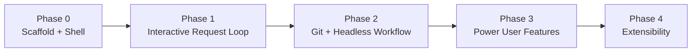
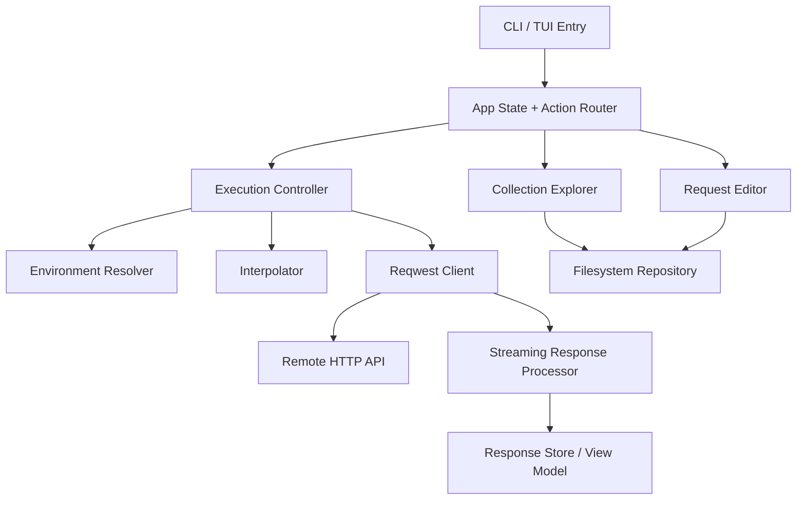
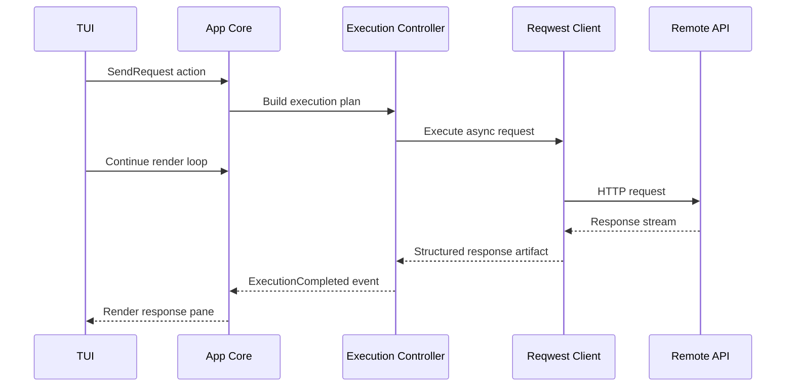
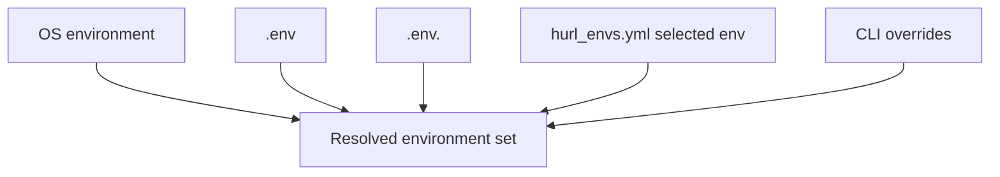

# hurl Phased Technical Specification

Version: 1.0  
Date: March 29, 2026  
Status: Draft  
Related document: [hurl PRD](docs/plans/2026-03-29-hurl-prd.md)

## Purpose

This document translates the PRD into a technical specification focused on what hurl builds in each delivery phase. It is intentionally pre-implementation: it defines system boundaries, module responsibilities, interface contracts, risk controls, and acceptance criteria without turning into a task-by-task execution plan.

The primary audience is engineering, product, and design collaborators who need a shared technical understanding of:

- what is in each phase,
- what is deferred,
- how the architecture evolves,
- and which technical decisions must stay stable across phases.

## Document Scope

This specification covers:

- phased technical scope,
- architecture evolution,
- module and subsystem responsibilities,
- data contracts and persistence shape,
- TUI and CLI behavior by phase,
- testing expectations,
- and readiness gates.

This specification does not cover:

- sprint-level task breakdowns,
- file-by-file implementation steps,
- exact commit sequencing,
- or code generation/scaffolding commands.

## Guiding Technical Principles

### Stable principles across all phases

- One core engine, two interfaces: TUI and headless CLI must share the same execution core.
- Filesystem is the source of truth: request collections and environments are disk-backed, human-editable text.
- Async isolation: network and expensive parsing work must never block the terminal event loop.
- Progressive enhancement: each phase should leave a clean, composable path to the next without forcing rewrites.
- Operational honesty: large responses, binary payloads, and missing variables should be surfaced explicitly rather than hidden behind convenience abstractions.
- Low accidental complexity: avoid introducing scripting, plugins, sync, or non-local state before the core request loop is excellent.

### Architecture constraints

- Rust is the implementation language.
- Ratatui is the primary TUI layer.
- Tokio is the concurrency and async execution runtime.
- Reqwest is the HTTP transport client.
- YAML is the initial persistence format for request documents.
- No remote backend is required in any planned phase through V1.

## System Baseline

Before breaking work into phases, the system should be understood as five long-lived technical subsystems:

| Subsystem | Responsibility |
|---|---|
| Shell | Process startup, CLI parsing, terminal lifecycle, graceful shutdown |
| Application Core | Global app state, actions, focus, events, orchestration |
| Request Domain | Request model, interpolation, validation, assertions, response model |
| Storage | Collection discovery, file load/save, formatting, environment sources |
| Execution | HTTP client, cancellation, streaming, response decoding |

## Phase Map

## Cross-Phase Architecture

### Logical architecture

### Required stable seams

These seams should remain stable from Phase 0 onward:

- `RequestRepository`: discover, load, save request documents.
- `EnvironmentProvider`: load and resolve environment values from layered sources.
- `ExecutionPlanner`: transform a saved request plus environment into an executable HTTP plan.
- `HttpExecutor`: execute an HTTP plan and emit structured response artifacts.
- `AppAction` / `AppEvent`: single vocabulary for UI, worker, and file-watcher interactions.

If these seams drift across phases, TUI and CLI parity will become expensive.

## Phase 0: Scaffold and Application Shell

### Goal

Establish the application shell, terminal lifecycle, and internal architecture skeleton so later phases add behavior rather than restructure the app.

### Why this phase exists

hurl is not a single-screen toy TUI. It needs:

- multiple independently focused panes,
- background request execution,
- a reusable CLI entrypoint,
- panic-safe terminal restoration,
- and modular application state.

That means Phase 0 must optimize for architecture shape, not features.

### Recommended scaffold baseline

Phase 0 should start from the official Ratatui templates, specifically the `component` template documented at [ratatui.rs/templates](https://ratatui.rs/templates/). This is the best fit because it already assumes:

- multiple components,
- explicit action routing,
- CLI argument parsing,
- config/logging separation,
- and a production-ready TUI lifecycle.

### In scope

- CLI bootstrap with top-level `hurl` process entry.
- Terminal initialization and restoration.
- Panic-safe cleanup path.
- Skeleton three-pane layout:
  - left: collection explorer,
  - top-right: request editor,
  - bottom-right: response viewer.
- Global focus management and keyboard routing.
- Placeholder application state and action enum.
- Base logging and diagnostics hooks.
- Graceful shutdown path for idle app exit.

### Out of scope

- Real file discovery.
- Real HTTP execution.
- Real request editing persistence.
- Real response rendering.
- Environment support.
- Assertions.

### Technical decisions locked in this phase

| Area | Decision |
|---|---|
| UI organization | Component-oriented Ratatui app |
| State model | Central app model plus typed actions/events |
| Concurrency | Tokio runtime from the start |
| Error surface | Recoverable app errors plus panic-safe terminal restoration |
| Logging | Structured tracing, file or stderr depending on terminal mode |

### Runtime behavior requirements added in this phase

- Render cadence and app ticks are independent. `frame_rate` controls redraw cadence; `tick_rate` is reserved for app-level time-based work.
- Key routing must ignore release-only key events so the app behaves consistently across Windows, macOS, and Linux.
- File logging must not prevent the shell from launching. If the preferred log directory is unavailable, the app should fall back to another writable local path.
- Terminal setup must be rollback-safe: if initialization fails after raw mode or alternate-screen entry, the shell must still be restored before the error is surfaced.

### Required modules

| Module | Responsibility |
|---|---|
| `main` | Startup and process wiring |
| `cli` | Command parsing and mode selection |
| `tui` | Terminal setup, draw loop, teardown |
| `app` | Root model, focus state, action dispatch |
| `action` | Shared action/event vocabulary |
| `components/*` | Render and input handling for panes |
| `logging` | Tracing setup and sink configuration |

### UI contract at end of phase

- App opens instantly into a stable multi-pane shell.
- User can cycle focus among panes.
- Resize events reflow layout correctly.
- Quit path restores terminal reliably.
- Bottom help bar communicates essential controls.

### Acceptance criteria

- App starts and exits cleanly from supported terminals.
- Terminal state is restored on normal exit and panic.
- No pane input causes focus corruption or crash.
- The shell is structured so later feature work does not require relocating core modules.

## Phase 1: Interactive Request Loop

### Goal

Deliver the first end-to-end value loop: discover a request, edit it, execute it asynchronously, and inspect a response inside the TUI.

### Phase outcome

At the end of Phase 1, hurl becomes a usable local API client for interactive development work, even if Git- and CI-centric workflows are still incomplete.

### In scope

#### Collection discovery

- Recursively discover `.hurl.yml` files from the current working directory.
- Represent collections as a file-backed tree in the left pane.
- Ignore heavyweight or irrelevant directories such as `.git`, `target`, and `node_modules`.
- Collapse/expand interactions must be reversible without forcing a full refresh; the UI should preserve an in-memory canonical tree and derive the visible list from it.

#### Request editing

- Editable method field.
- Editable URL.
- Header grid.
- Query parameter grid.
- Multi-line body editor for text payloads.
- Dirty-state tracking between in-memory edits and saved files.
- Save/send actions must include the currently focused edit buffer even if the user has not left insert mode yet.

#### Persistence

- Load request document from YAML.
- Save current request to YAML.
- Preserve a readable and stable format.

#### Execution

- Build effective request from current editor state.
- Execute in background using a reusable Reqwest client.
- Allow request cancellation without exiting the app.
- Surface transport errors cleanly in the response pane.
- Keep cancellation active while the response body is streaming, not only before first byte.

#### Response inspection

- Display status code, latency, content type, size, and headers.
- Render text body preview.
- Pretty-print JSON where feasible.
- Avoid blocking render loop during network wait.
- Read large bodies progressively and stop once the preview cap is reached rather than buffering the full payload first.
- Header inspection must support real viewport scrolling when the header list exceeds the visible pane height.

### Out of scope

- Headless `hurl run`.
- Rich assertions engine.
- Response diffing.
- Scripting/hooks.
- Plugin system.
- Persistent run history.

### Technical architecture added in this phase

| Subsystem | New responsibilities |
|---|---|
| Storage | YAML parsing/serialization, request discovery |
| Request Domain | Request document schema, validation, body modes |
| Execution | Background task spawn, cancellation, response normalization |
| Presentation | Dirty state, form editing, error display, loading states |

### Request execution lifecycle

### Data contracts introduced in this phase

#### Request document

Must include enough structure to support editing and stable serialization:

- name
- method
- url
- params
- headers
- body
- optional metadata

#### Response artifact

Must normalize Reqwest output into UI-friendly state:

- status code,
- HTTP version,
- duration,
- header map,
- content type,
- content length if known,
- body classification,
- text preview or external body handle.

### UI behavior requirements

- Sending a request must not freeze keyboard navigation in unaffected parts of the UI.
- If a request is in flight, the current request editor remains visible.
- If a request fails, previous successful response state should not be silently lost unless replaced intentionally.
- Loading states must be explicit and cancelable.
- If the user saves or sends while a grid cell is mid-edit, the persisted/executed request must reflect what is currently visible in that cell.

### Error model for this phase

| Error Type | UI Handling |
|---|---|
| Invalid request document | Show inline error before send |
| File read/write failure | Show toast/status error and preserve editor state |
| Network timeout | Mark run failed with timeout-specific messaging |
| DNS/connection failure | Show transport error summary |
| Invalid response decoding | Preserve metadata and offer raw body behavior if possible |

### Acceptance criteria

- User can open, edit, save, and execute a request from the TUI.
- UI remains responsive during request execution.
- Canceling an in-flight request returns app to idle state without corruption.
- JSON responses are readable.
- Error states are visible and recoverable.

## Phase 2: Git Workflow and Headless Runner

### Goal

Turn the interactive client into a tool that also fits automation, CI, and team workflows.

### Phase outcome

At the end of Phase 2, any request file used in the TUI is also executable in a headless, script-friendly mode with environment resolution and predictable exit behavior.

### In scope

#### Headless CLI mode

- `hurl run <file>`
- optional `--env <name>`
- stdout/stderr output modes
- non-zero exit code semantics

#### Environment resolution

- Load `.env`
- Load `.env.<name>`
- Load `hurl_envs.yml`
- Merge sources using documented precedence
- Detect unresolved template variables
- Resolve environment files relative to the request file being run in headless mode; only fall back to process cwd for unsaved in-memory requests

#### File workflow support

- Formatter for canonical YAML ordering and spacing
- Validator for request schema and environment interpolation
- Better change detection and reload rules for externally edited files

#### CI and shell ergonomics

- Output modes that are stable for scripts
- Quiet mode and summary mode
- Assertion-ready exit code model even if assertions are still minimal

### Out of scope

- Advanced auth flows.
- Response diffing UI.
- Plugin host.
- Hook runtime.

### New technical capabilities

| Capability | Description |
|---|---|
| Shared execution core | Same plan builder and executor used by TUI and CLI |
| Environment graph | Deterministic merge model for variable sources |
| Validation layer | Parse + schema + unresolved variable checks |
| Formatting layer | Stable serializer for cleaner Git diffs |

### CLI mode contract

Headless mode must not be a separate codepath with different behavior. It should:

- load the same request schema,
- resolve the same interpolation rules,
- locate environment files from the same request-local context,
- build the same execution plan,
- execute through the same HTTP core,
- and classify results through the same response model.

The only difference should be presentation: TUI view state versus stdout/stderr plus exit code.

### Environment resolution model

Recommended precedence, highest wins:

1. CLI overrides
2. selected named environment from `hurl_envs.yml`
3. `.env.<name>`
4. `.env`
5. OS environment

In headless mode, these sources are discovered from the request file's parent directory rather than the shell's current working directory. This keeps nested request collections runnable from anywhere in a repo or CI workspace.

### Validation rules introduced in this phase

- Unknown required fields fail validation.
- Unresolved `{{variables}}` fail validation before send in headless mode.
- Interpolated URLs must parse as real URLs; missing schemes produce warnings, malformed absolute URLs produce errors.
- Header names must be valid HTTP header names before execution.
- Invalid body mode configuration fails validation.
- Unsupported assertion syntax should fail fast rather than be ignored.

### Acceptance criteria

- A request file saved by the TUI can be run headlessly with matching behavior.
- Environment selection is deterministic and documented.
- Validation catches broken request files before network execution.
- Formatting produces stable, review-friendly diffs.

## Phase 3: Power User Features

### Goal

Add advanced inspection and verification capabilities that meaningfully improve power-user workflows without changing hurl’s local-first core.

### Phase outcome

At the end of Phase 3, hurl supports richer validation and comparison flows, making it useful not only for manual request sending but also for structured regression checking.

### In scope

#### Assertions engine

- Evaluate response status assertions.
- Evaluate latency assertions.
- Evaluate body-path assertions for structured JSON when feasible.
- Surface assertion results in both TUI and headless modes.

#### Response diffing

- Compare two stored responses or two executed runs.
- Initial scope should favor text diff and normalized JSON diff.
- UI should clearly show which side is baseline and which side is candidate.

#### Richer response exploration

- Improved JSON navigation beyond plain pretty-printing.
- Better large-body handling with progressive or windowed rendering.
- Save-body flows for large or binary payloads.

### Out of scope

- Full scripting engine.
- Full auth plugin catalog.
- Remote team sync.

### New domain concepts

| Concept | Responsibility |
|---|---|
| AssertionResult | Pass/fail plus message and optional path |
| StoredRun | Serializable execution output for comparison |
| DiffArtifact | Unified representation for text and structured diffs |

### Assertion execution model

Assertions should sit above HTTP execution, not inside it. The recommended pipeline is:

1. Build request.
2. Execute request.
3. Produce normalized response artifact.
4. Evaluate assertions against normalized artifact.
5. Emit a run result that combines transport status and assertion status.

This keeps transport concerns and verification concerns separate.

### Response persistence decision in this phase

Phase 3 must decide whether response diffing relies on:

- transient in-memory response artifacts only,
- explicit save/export actions,
- or an opt-in local run cache.

The recommended approach is opt-in local run persistence to avoid surprising disk usage in early versions.

### Acceptance criteria

- Assertions are visible and reliable in both TUI and CLI.
- Diffing is usable for typical JSON API regression workflows.
- Large and binary response handling is operationally safe.

## Phase 4: Extensibility Platform

### Goal

Provide a controlled path for advanced auth, scripting, and organization-specific extensions without bloating the core product.

### Phase outcome

At the end of Phase 4, hurl gains an extensibility layer while keeping the core request loop stable and lightweight for users who do not need plugins.

### In scope

#### Hook points

- Pre-request mutation hook.
- Post-response inspection hook.
- Custom auth provider hook.
- Variable provider hook.

#### Plugin runtime

- Sandboxed plugin boundary.
- Explicit capability model.
- Versioned plugin API.
- Failure isolation so plugin errors do not destabilize the host.

### Out of scope

- Unsandboxed native plugin loading.
- Networked plugin marketplace in initial extensibility release.
- Multi-user hosted collaboration.

### Plugin architecture constraints

- The host API must be narrow and capability-driven.
- Plugins should not have implicit access to all environment variables or filesystem paths.
- Plugin execution must be observable, cancellable, and bounded.
- Blocking plugin execution must stay off the async request path.
- Core request execution must remain usable when the plugin subsystem is disabled.

### Recommended extension surface

| Surface | Example use |
|---|---|
| Request mutation | Add signed auth headers |
| Variable provider | Inject ephemeral tokens |
| Response hook | Extract fields or generate follow-up context |
| Auth provider | AWS SigV4, OAuth token refresh |

### Acceptance criteria

- Core workflows remain fast and stable without plugins enabled.
- Plugin failure does not crash the app or corrupt request state.
- Auth providers are opt-in per request rather than implicitly applied to every request.
- Security boundaries are explicit and reviewable.

## Data Model Evolution by Phase

### Phase 0

- `AppState`
- `FocusTarget`
- `AppAction`

### Phase 1

- `RequestDocument`
- `RequestBody`
- `KeyValueField`
- `ExecutionPlan`
- `ResponseArtifact`

### Phase 2

- `EnvironmentSet`
- `ValidationReport`
- `RunResult`
- `CliOutputMode`

### Phase 3

- `Assertion`
- `AssertionResult`
- `StoredRun`
- `DiffArtifact`

### Phase 4

- `PluginManifest`
- `PluginCapability`
- `PluginInvocation`
- `HookResult`
- `AuthRequest` / `AuthResult`
- `ResponseContext`
- `RequestDocument.auth_plugin`

## Technical Risks by Phase

| Phase | Risk | Mitigation |
|---|---|---|
| 0 | Overbuilding shell before proving value | Keep shell modular but feature-thin |
| 1 | UI freezes from request/formatting work | Async execution plus bounded parsing and `spawn_blocking` where necessary |
| 1 | YAML model too weak for future features | Reserve extensible schema sections and tolerate unknown fields where safe |
| 2 | TUI and CLI behavior diverge | Share execution core and validation pipeline |
| 2 | Environment precedence becomes confusing | Document and test deterministic merge order |
| 3 | Assertions become mini language too early | Start with narrow built-in predicates |
| 3 | Diffing large responses becomes memory-heavy | Use size thresholds and opt-in persistence |
| 4 | Plugin system blocks or destabilizes async request execution | Strict capability model, `spawn_blocking`, bounded manifests, and failure isolation |

## Testing Strategy by Phase

### Phase 0

- TUI shell rendering tests.
- Focus and action routing tests.
- Terminal lifecycle and panic restoration checks.

### Phase 1

- Request YAML parsing and serialization tests.
- Request editor state tests.
- Execution integration tests against local mock HTTP servers.
- Cancellation and timeout behavior tests.
- Response rendering tests for text and JSON bodies.

### Phase 2

- Environment precedence tests.
- CLI parity tests against TUI execution core.
- Exit code contract tests.
- Validation and formatter snapshot tests.

### Phase 3

- Assertion engine tests.
- Diff normalization tests.
- Large-response and binary-handling tests.

### Phase 4

- Plugin host boundary tests.
- Capability isolation tests.
- Failure containment tests.

## Phase Readiness Gates

### Gate to exit Phase 0

- Shell architecture is stable enough that feature work can land without structural churn.
- Terminal lifecycle is reliable.
- Focus and layout model are proven.

### Gate to exit Phase 1

- The app is genuinely usable for interactive local API testing.
- Request execution is responsive and cancellable.
- Saved requests round-trip cleanly through YAML.

### Gate to exit Phase 2

- Files created in the TUI are automation-ready.
- CI usage is practical and predictable.
- Environment behavior is deterministic.

### Gate to exit Phase 3

- Verification workflows are strong enough for regression-style use.
- Diffing and assertions improve real workflows instead of adding surface area only.

### Gate to exit Phase 4

- Extensibility increases capability without turning hurl into a bloated platform.

## Explicit Non-Goals Through V1

- Cloud sync
- Team accounts
- Collaborative editing
- API documentation hosting
- GUI desktop wrapper
- gRPC or GraphQL schema tooling beyond basic HTTP use
- Complex workflow automation engine

## Open Technical Questions

1. Should request bodies larger than a threshold open an external editor flow instead of a fully in-TUI editing experience?
2. Should file watching be required for V1, or is manual refresh sufficient if watcher behavior is inconsistent across terminals/platforms?
3. How much of auth should be first-class before Phase 4?
4. Should saved responses be persisted in a dedicated local cache format, and if so should that cache be Git-ignored by default?
5. What is the minimum viable structured assertion language that remains readable in YAML?
6. When diffing JSON responses, should normalization preserve key order from source or sort keys for semantic comparison?
7. For plugin runtime, should the project standardize on Wasmtime directly, Extism, or defer until a narrower set of hooks is proven?

## Recommended Next Documentation Artifact

The next document after this one should not be code. It should be a focused implementation plan for Phase 0 only, derived from this spec and the PRD, so the first engineering pass stays disciplined and does not pull future-phase complexity into the scaffold.
